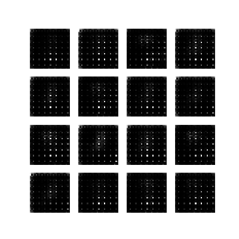
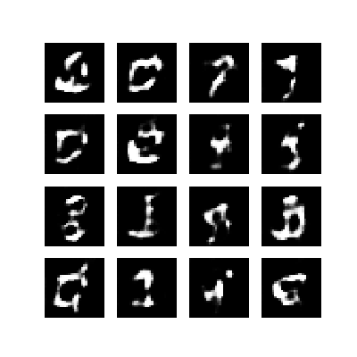
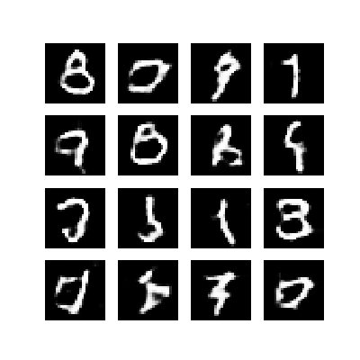

## Les GAN (Generative Adversarial Networks)

### Introduction
Les réseaux de Neurones sont souvent utilisés en classification,
ou en régression.

En classification, la couche de sortie contient
autant de neurones que de classes.
Pour une entrée donnée, le réseau va apprendre, a partir d'une base d'exemples
quel neurone de sortie doit répondre le plus fortement.

En régression, la couche de sortie ne contient qu'un neurone.
Pour une entrée donnée, le réseau va apprendre, toujours à partir
d'une base d'exemples, quelle valeur doit donner le neurone de sortie.

Ici, nous souhaitons que le réseau apprenne à générer des sorties
qui ressemblent aux exemples d'une base prédéfinie.
Ces technologies sont relativement récentes (2014) et ont de multiples
applications. Notons ainsi :

- pour la **mode** et la **publicité** la créations de photos de faux modèles.
- pour les **jeux video** la creation de textures réalistes
- pour les **arts plastiques** la création de tableaux
- pour la **musique** la création de pièces musicales
- en **design** la création de nouveaux objets
- en **infographie**, la création de visages réalistes

On le voit, l'objectif est de donner aux IA une capacité de création !
Vous pouvez jetter un coup d'oeil sur ce site qui liste des [applications
bluffantes de ces réseaux adverses génératifs](https://machinelearningmastery.com/impressive-applications-of-generative-adversarial-networks/).

Bon, mais du coup, on fait comment ?


### Principe en deux mots

Prenons l'exemple qui nous servira en TP : on veut générer des images de
chiffres manuscrits, semblables à ceux de la base MNIST.

Il faut toujours une base d'exemples pour savoir quel type de résultats est
attendu (facile : MNIST)

#### Le Générateur

Il va nous falloir un Réseau de Neurones qu'on appelera le **générateur**
L'architecture de ce générateur est simple :
- en entrée, des neurones auxquels on fournira un bruit permettant de faire
varier les images générées.
- en sortie, autant de neurones que de pixels dans une image MNIST (28x28 = 784)
- entre les deux : une architecture quelconque (on raffinera plus tard)

Avec ce générateur, si on introduit un bruit en entrée, on obtient une image
de 28x28 pixels en sortie.

Reste à lui faire apprendre comment créer des images produites ressemblant à
celle de MNIST. Il faudrait que pour chaque image produite, on puisse
dire au **générateur** si sa production est bonne ou mauvaise.

#### Le Discriminateur

L'idée (géniale) des GAN est d'utiliser un second réseau de neurones, le
**discriminateur**. Celui ci agit comme un **expert** qui a pour but
de dire si une image qu'on lui présente est bien issue de la base **MNIST**.
C'est un réseau de régression qui répond **vrai** (1) ou **faux** (0)

On présentera donc au discriminateur des exemples de MNIST (annotés vrais)
et des exemples venus du générateur (annotés faux), et le discriminateur
doit faire la différence.

L'architecture du discriminateur est simple :

- en entrée, autant de neurones que de pixels dans une image MNIST (28x28 = 784)
- en sortie, un neurone (0 signifie faux, 1 signifie vrai)
- entre les deux : une architecture quelconque (on raffinera plus tard)

#### Les fonctions de coûts à optimiser

Le discriminateur doit agir comme un **expert** qui doit reconnaitre les vraies
images de MNIST mélangées avec des images du générateur.

la fonction de coût du discriminateur est facile : elle est relative
aux décisions qu'il prend pour un exemple et doit augmenter avec ses erreurs.

On prendra souvent :
```
coutDiscriminateur = cross_entropy(decisions, labels)
```
Disons que notre base d'exemples est constituée de vraies exemples et de faux exemples,
on pourrait écrire ceci aussi comme suit :
```
coutDiscriminateur =
      cross_entropy(vraiesExemples, 1) +
      cross_entropy(fauxExemples,0)
```

Le discriminateur va, dans son apprentissage, modifier ses poids pour avoir
un coût aussi bas que possible dépendant de ses décisions.

Le générateur doit, quand à lui, agir comme un **faussaire** qui devra faire
des images réalistes capable de tromper l'expert.
Le cout doit donc augmenter chaque fois que l'expert identifie
ses réalisations comme fausses.
On pourra prendre comme fonction de coût du discriminateur

```
coutDiscriminateur = cross_entropy(fauxExemples,1)
```

Ici, nous avons un réseau (le **générateur**) dont la fonction de coût dépend
en fait des résultats d'un autre réseau (le **discriminateur**).


#### Stratégie globale d'apprentissage

Si le discriminateur est trop bon, peu importe les ajustements que fera
le générateur, le discriminateur repèrera ses exemples.
La recherche des poids optimaux pour le générateur sera donc très compliquée.

Il est donc primordial que nos deux réseaux apprennent "au même rythme" :
un faussaire pas très bon essaie de tromper un expert pas très bon.
Puis chacun tire les leçons de ses erreurs et progresse.
Le faussaire devient meilleur, l'expert aussi.

L'état final qui nous intéresse est d'obtenir un faussaire génial
capable de tromper un expert génial. On a alors un générateur capable de
produire des oeuvres trompant tout le monde (y compris un humain).

### Quelques exemples

J'ai repris un tutoriel existant concernant les GAN appliqués à MNIST, dont je
vais maintenant vous montrer les résultats.

Voici le fonctionnement, qui me permettra de vous indiquer quelques temps
de calculs.


1. Le générateur génère 256 images.
2. On les mixe avec 256 images de MNIST.
3. Le discriminateur prend ses décisions.
4. Chaque classifieur modifie ses poids en rapport avec sa fonction de coût

Ceci est un batch.

On répète les batchs jusqu'à avoir passé toute la base MNIST (soit 234 batchs).
Ceci constitue une epoch.

On entraine les classifieurs sur 50 epochs.

Tous les calculs ont été fait sur un ordinateur relativement puissant, mais
sans utiliser le GPU pour accélerer les calculs.

- Un batch dure ~1s.
- Une epoch dure ~5mn
- l'apprentissage complet dure ~4h10mn

Voici quelques images obtenues au cours de l'apprentissage

| epoch 1  | epoch 20  | epoch 50  |
|---|---|---|---|---|
|   |   |   |

Comme on peut le voir, le résultat à la fin des 50 epochs est relativement
convaincant, meme si certains chiffres sont un poil étranges.

Le tout en animation :


